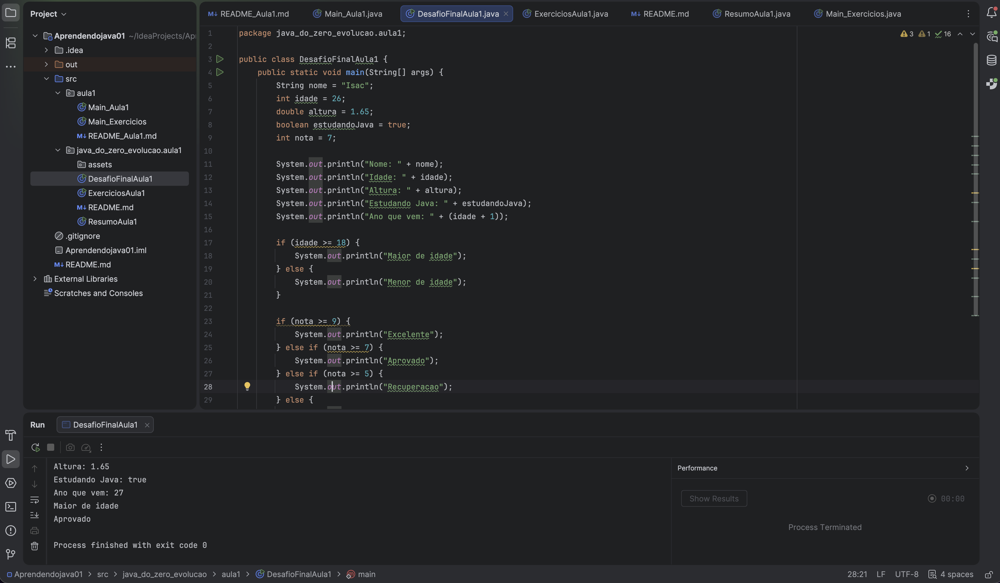
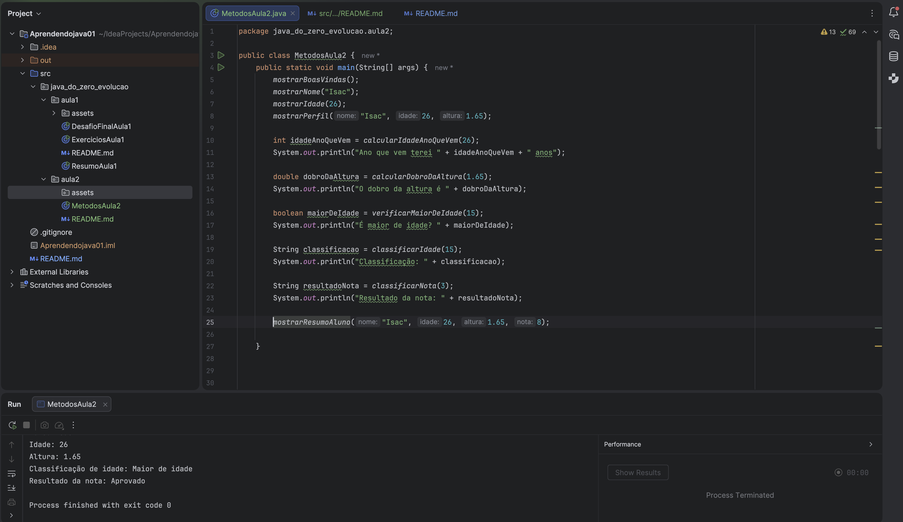

# Java do Zero - Evolucao

Este repositorio registra minha evolucao aprendendo Java do zero.

## Aula 1

Na Aula 1 eu pratiquei:

- Criacao e execucao de um projeto Java no IntelliJ IDEA
- Uso de `System.out.println`
- Variaveis com `String`, `int`, `double` e `boolean`
- Concatenacao de texto com variaveis
- Operadores matematicos
- Comparacoes
- Condicionais com `if`, `else` e `else if`

### Print do desafio da Aula 1



## Estrutura

```text
src/
  java_do_zero_evolucao/
    aula1/
      ResumoAula1.java
      ExerciciosAula1.java
      DesafioFinalAula1.java
      README.md
```

## Objetivo

Mostrar minha evolucao pratica em Java com aulas, exercicios e desafios organizados.

## Proximos passos

- Operadores logicos: `&&`, `||` e `!`
- Entrada de dados com `Scanner`
- Pequenos desafios praticos


## Aula 2

### Print do desafio da Aula 2



Na Aula 2 eu pratiquei:

- Criação de métodos
- Métodos com `void`
- Parâmetros e argumentos
- Métodos com `return`
- Retorno com `int`, `double`, `boolean` e `String`
- Uso de `if`, `else if` e `else` dentro de métodos
- Um método chamando outro método
- Organização do código fora do `main`

📁 [Ver arquivos da Aula 2](src/java_do_zero_evolucao/aula2)

## Aula 3

### Print do desafio da Aula 3


Na Aula 3 eu pratiquei:

- Criação de classes e objetos
- Criação da classe `Aluno`
- Uso de atributos como `nome`, `idade` e `nota`
- Instanciação de objetos com `new`
- Acesso aos atributos usando o ponto `.`
- Métodos dentro de uma classe
- Método `void` para mostrar dados
- Método com retorno `boolean`
- Método com retorno `String`
- Um método chamando outro método
- Organização de responsabilidades entre classes
- Teste de regra de aprovação com `nota >= 7`

📁 [Ver arquivos da Aula 3](src/java_do_zero_evolucao/aula3)
