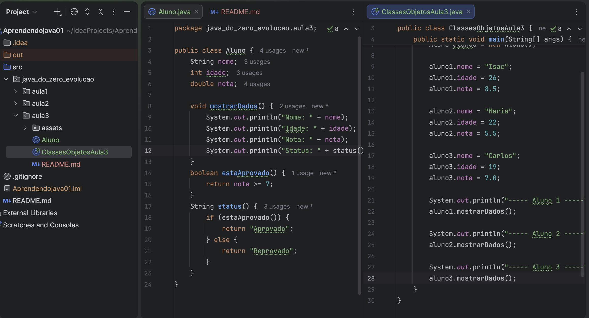

# Aula 3 - Classes e Objetos em Java



Nesta aula, avancei dos fundamentos de Java para os primeiros conceitos de Orientação a Objetos.

Nas aulas anteriores, eu trabalhava com variáveis, métodos e regras diretamente dentro do `main`. Agora comecei a organizar melhor o código criando uma classe própria para representar um aluno.

## Objetivo da aula

Entender como o Java usa classes e objetos para representar entidades do mundo real dentro do código.

Nesta aula, a entidade escolhida foi um aluno. A partir dela, pratiquei atributos, objetos, métodos e responsabilidades.

## Estrutura criada

```text
src/
  java_do_zero_evolucao/
    aula3/
      Aluno.java
      ClassesObjetosAula3.java
      README.md
      assets/
        desafio-aula3.png
```

## Arquivos da aula

`Aluno.java`

Representa o molde de um aluno. Nele ficam os dados e comportamentos relacionados ao aluno.

`ClassesObjetosAula3.java`

Arquivo usado para executar a aula. Nele foram criados objetos a partir da classe `Aluno`.

## O que eu pratiquei

- Criação de uma classe chamada `Aluno`
- Criação de atributos dentro de uma classe
- Criação de objetos usando `new`
- Acesso aos atributos usando o ponto `.`
- Criação de métodos dentro de uma classe
- Uso de método `void`
- Uso de método com retorno `boolean`
- Uso de método com retorno `String`
- Um método chamando outro método
- Organização de responsabilidades entre classes
- Teste de regra usando nota maior ou igual a 7
- Teste de limite com nota `7.0`

## Conceitos aprendidos

Classe é um molde usado para criar objetos.

Objeto é uma instância criada a partir de uma classe.

Atributos são informações que pertencem a um objeto.

Métodos são ações ou comportamentos que um objeto pode executar.

## Classe Aluno

Na classe `Aluno`, criei três atributos:

```java
String nome;
int idade;
double nota;
```

Esses atributos representam as informações que cada aluno pode ter.

Também criei métodos para que o próprio aluno consiga mostrar seus dados e informar seu status.

```java
void mostrarDados() {
    System.out.println("Nome: " + nome);
    System.out.println("Idade: " + idade);
    System.out.println("Nota: " + nota);
    System.out.println("Status: " + status());
}
```

Esse método é `void` porque ele apenas executa uma ação: mostrar informações no console.

```java
boolean estaAprovado() {
    return nota >= 7;
}
```

Esse método retorna `boolean`, porque a resposta só pode ser `true` ou `false`.

```java
String status() {
    if (estaAprovado()) {
        return "Aprovado";
    } else {
        return "Reprovado";
    }
}
```

Esse método retorna `String`, porque transforma o resultado lógico em um texto mais claro para quem está lendo o programa.

## Objetos criados

No arquivo `ClassesObjetosAula3.java`, criei três objetos:

```java
Aluno aluno1 = new Aluno();
Aluno aluno2 = new Aluno();
Aluno aluno3 = new Aluno();
```

Cada objeto usa o mesmo molde `Aluno`, mas guarda seus próprios valores.

```java
aluno1.nome = "Isac";
aluno1.idade = 26;
aluno1.nota = 8.5;

aluno2.nome = "Maria";
aluno2.idade = 22;
aluno2.nota = 5.5;

aluno3.nome = "Carlos";
aluno3.idade = 19;
aluno3.nota = 7.0;
```

## Regra de aprovação

A regra usada foi:

```java
nota >= 7
```

Se a nota for maior ou igual a 7, o aluno está aprovado.

Se a nota for menor que 7, o aluno está reprovado.

## Resultado esperado

```text
----- Aluno 1 -----
Nome: Isac
Idade: 26
Nota: 8.5
Status: Aprovado

----- Aluno 2 -----
Nome: Maria
Idade: 22
Nota: 5.5
Status: Reprovado

----- Aluno 3 -----
Nome: Carlos
Idade: 19
Nota: 7.0
Status: Aprovado
```

## O que eu entendi

Antes, meus dados ficavam soltos dentro do `main`.

Agora entendi que posso criar uma classe para representar algo real, como um aluno.

A classe `Aluno` guarda informações e também possui comportamentos próprios.

Também entendi que cada objeto criado a partir da mesma classe possui seus próprios valores.

Por exemplo, `aluno1`, `aluno2` e `aluno3` são todos do tipo `Aluno`, mas cada um possui nome, idade e nota diferentes.

## Evolução em relação às aulas anteriores

Na Aula 1, eu aprendi variáveis, operadores, comparações e condicionais.

Na Aula 2, eu aprendi métodos, parâmetros e retornos.

Na Aula 3, comecei a juntar essas ideias dentro de uma classe, criando objetos com dados e comportamentos.

Essa aula marcou meu primeiro contato prático com Orientação a Objetos em Java.

## Próxima aula

Na próxima aula, vou estudar construtores.

Hoje eu crio um aluno assim:

```java
Aluno aluno1 = new Aluno();

aluno1.nome = "Isac";
aluno1.idade = 26;
aluno1.nota = 8.5;
```

Com construtores, vou aprender a criar objetos de forma mais limpa:

```java
Aluno aluno1 = new Aluno("Isac", 26, 8.5);
```

Isso vai deixar o código mais organizado e mais próximo do que é usado em projetos reais.
